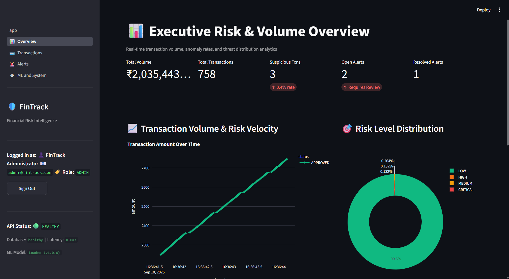
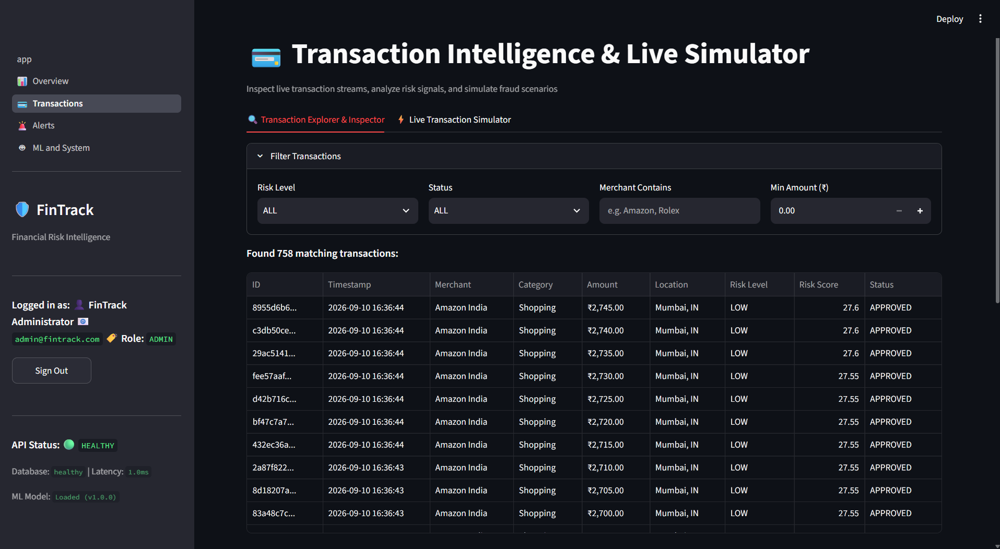
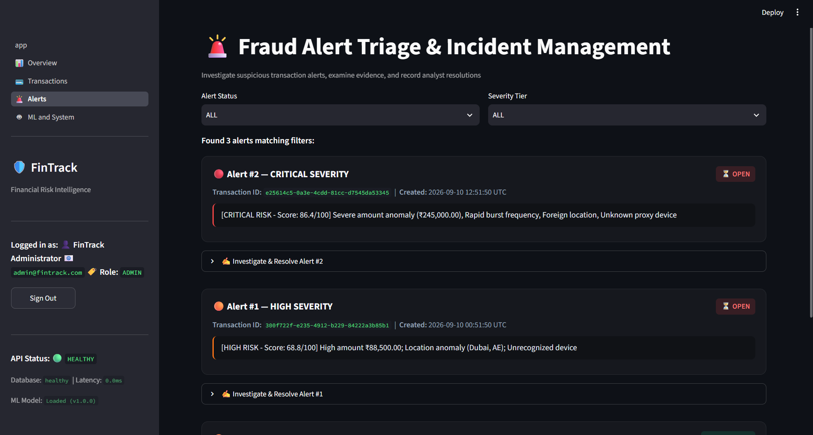
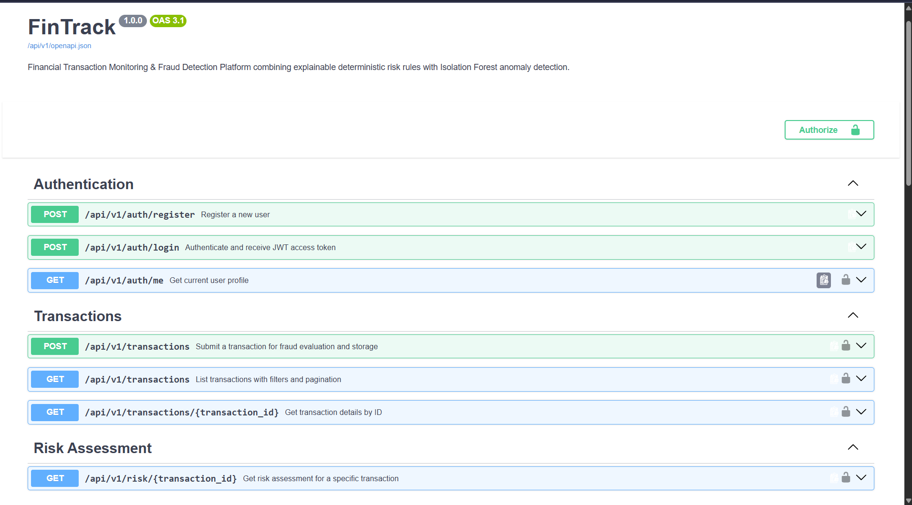

# FinTrack: Financial Transaction Monitoring & Fraud Detection Platform

Python-based financial transaction monitoring and fraud detection platform using FastAPI, PostgreSQL, Isolation Forest, Streamlit, and Docker.

**Repository:** `https://github.com/schr0dy-coder/FinTrack`  
**GitHub Topics:** `python` | `fastapi` | `postgresql` | `machine-learning` | `fraud-detection` | `scikit-learn` | `streamlit` | `docker` | `rest-api` | `fintech`

> **Note on Data & Scope:** This system is an engineering prototype developed for transaction risk profiling and fraud detection workflows. All datasets, user profiles, and financial transactions are synthetically generated and do not contain real customer or banking information.

---

## 1. Overview

FinTrack evaluates financial transactions as they are submitted through a synchronous ingestion and risk assessment pipeline. It addresses real-world fraud detection challenges—such as velocity abuse, geographic hopping, credential stuffing, and unusual high-value spending—using a hybrid architecture:

- **Deterministic Rules Engine:** 5 behavioral rules producing human-readable risk reasons.
- **Unsupervised Anomaly Detection:** An 8-feature Isolation Forest model identifying multidimensional anomalies using historical context prior to each transaction.
- **Hybrid Risk Scoring:** Weighted aggregation ($0.60 \times \text{Rule} + 0.40 \times \text{ML}$) mapped to 4 standard risk tiers (`LOW`, `MEDIUM`, `HIGH`, `CRITICAL`).
- **Analyst Triage Queue:** High and critical risk transactions automatically trigger alerts with resolution workflows.

---

## 2. Screenshots

### Analyst Dashboard


### Transaction Investigation


### Alert Triage


### API Documentation


---

## 3. Features

- **Layered Architecture:** Strict separation between API routes, business services, data repositories, and database models.
- **Explainable Behavioral Rules:** Independently testable rules with stable codes (`HIGH_AMOUNT`, `RAPID_TRANSACTIONS`, `NEW_DEVICE`, `LOCATION_ANOMALY`, `FAILED_ATTEMPT_PATTERN`).
- **Temporally Leakage-Safe ML Pipeline:** Historical-only feature construction with strict chronological train/test evaluation (80/20 split). Online inference and batch training share identical feature definitions.
- **Role-Based Access Control (RBAC):** JWT authentication with `USER` and `ADMIN` scopes; non-admin users cannot access other users' data or administrative triage endpoints.
- **Database Migrations:** Version-controlled database lifecycle managed via **Alembic** migrations.
- **Streamlit Analyst Portal:** Interactive visualization of platform volume, risk distributions, live transaction investigation, and alert resolution.
- **Comprehensive Test Suite:** 44 automated unit, integration, and API tests covering rules, ML inference, chronological evaluation, and security boundaries.

---

## 4. Architecture

```text
[Streamlit Analyst Dashboard]
              │
         HTTP │ (REST API / JWT Auth)
              ▼
     [FastAPI API Layer]
              │
              ▼
    [Application Services]
      ├── AuthService
      ├── TransactionService
      ├── RiskService
      ├── AlertService
      └── AdminService
           │        │
           │        ▼
           │  [Hybrid Risk Engine]
           │   ├── 5 Deterministic Rules (+10 to +25 score)
           │   ├── Feature Extraction (8 behavioral dimensions)
           │   ├── Isolation Forest Anomaly Detection (0–100 score)
           │   └── Weighted Formula: (0.60 * Rule) + (0.40 * ML)
           │
           ▼
    [Repositories Layer]
      ├── UserRepository
      ├── TransactionRepository
      ├── RiskAssessmentRepository
      └── AlertRepository
           │
           ▼
    [SQLAlchemy ORM + Alembic]
           │
           ▼
 [PostgreSQL / SQLite Database]
```

### Risk Scoring Formula & Classification

$$\text{Normalized Rule Score} = \min\left(100.0, \sum \text{Triggered Rule Scores}\right)$$

$$\text{Final Risk Score} = (0.60 \times \text{Rule Score}) + (0.40 \times \text{ML Score})$$

| Risk Score Range | Tier Level | Action Triggered |
|---|---|---|
| **0.0 – 29.99** | `LOW` | Auto-approved |
| **30.0 – 59.99** | `MEDIUM` | Approved with monitoring |
| **60.0 – 79.99** | `HIGH` | Marked `SUSPICIOUS`, opens Analyst Alert |
| **80.0 – 100.0** | `CRITICAL` | Marked `FLAGGED`, opens Critical Alert |

---

## 5. Tech Stack

- **Backend Framework:** FastAPI 0.110+, Uvicorn
- **Database & Migrations:** PostgreSQL 16 / SQLite, SQLAlchemy 2.0+, Alembic 1.13+
- **Machine Learning & Data:** scikit-learn 1.4+, Pandas 2.2+, NumPy 1.26+, Joblib
- **Authentication & Security:** PyJWT, bcrypt (cost factor 12)
- **Analyst Dashboard:** Streamlit 1.32+, Plotly 5.20+
- **Testing & Quality:** Pytest 8.1+, Pytest-Asyncio
- **Deployment:** Docker, Docker Compose

---

## 6. Project Structure

```text
FinTrack/
├── alembic/                         # Alembic database migration scripts
│   ├── env.py                       # Migration environment & metadata loader
│   └── versions/
│       └── 0001_initial_schema.py   # Initial database schema migration
├── app/
│   ├── main.py                      # FastAPI application entrypoint & middleware
│   ├── api/                         # Route controllers & dependency injection
│   │   ├── deps.py                  # JWT auth & RBAC dependencies
│   │   └── v1/                      # Endpoints: auth, transactions, alerts, admin
│   ├── core/                        # Configuration, security (bcrypt 12), and logging
│   ├── db/                          # Engine, session management, and Base
│   ├── models/                      # SQLAlchemy models (User, Transaction, Risk, Alert)
│   ├── schemas/                     # Pydantic validation models
│   ├── repositories/                # Data access layer
│   ├── services/                    # Business orchestration services
│   ├── risk_engine/                 # 5 deterministic rules, scoring, classifiers
│   └── ml/                          # Feature extraction, Isolation Forest trainer & inference
├── dashboard/                       # Streamlit multi-page analyst application
│   ├── app.py                       # Dashboard entrypoint & theme
│   └── pages/                       # Overview, Transactions, Alerts, ML & System
├── data/
│   └── synthetic/                   # Generated 5,000-transaction CSV dataset
├── models/
│   └── artifacts/                   # Serialized model (.joblib) & metadata JSON
├── scripts/
│   ├── generate_dataset.py          # Synthetic dataset generator CLI
│   ├── train_model.py               # Chronological ML training pipeline
│   ├── evaluate_model.py            # Held-out quantitative ML evaluation script
│   ├── benchmark.py                 # Performance & latency benchmark suite
│   └── seed_database.py             # Idempotent database seeder
├── docs/
│   ├── api-examples.md              # REST API request/response examples
│   ├── architecture.md              # Component interactions & security model
│   ├── ml_evaluation.md             # Held-out ML evaluation report
│   ├── benchmarks.md                # Measured API & ML latency report
│   └── images/                      # Dashboard, Transaction, Alert, and Swagger visuals
├── tests/                           # 44 automated test cases
├── Dockerfile                       # Multi-stage Docker container build
├── docker-compose.yml               # PostgreSQL + API + Dashboard stack
├── .dockerignore                    # Build exclusion rules for Docker
├── .env.example                     # Sample configuration template
├── .gitignore                       # Git exclusion rules
├── pyproject.toml                   # Project metadata & tool configuration
├── requirements.txt                 # Dependencies
└── README.md
```

---

## 7. Setup & Installation

### Local Virtual Environment

```bash
# 1. Clone repository and navigate to folder
git clone https://github.com/schr0dy-coder/FinTrack.git
cd FinTrack

# 2. Create and activate virtual environment
python -m venv venv
# Windows (PowerShell):
.\venv\Scripts\Activate.ps1
# Linux/macOS:
source venv/bin/activate

# 3. Install dependencies
pip install -r requirements.txt

# 4. Configure environment variables
cp .env.example .env
```

---

## 8. Environment Variables

Configuration is loaded from `.env` via Pydantic Settings:

| Variable | Default | Purpose |
|---|---|---|
| `DATABASE_URL` | `sqlite:///./fintrack.db` | Database connection string |
| `JWT_SECRET_KEY` | *(Set in `.env`)* | Secret key for signing JWT tokens |
| `JWT_ALGORITHM` | `HS256` | JWT cryptographic algorithm |
| `ACCESS_TOKEN_EXPIRE_MINUTES` | `1440` | Token expiration duration (24h) |
| `HIGH_AMOUNT_THRESHOLD` | `50000.0` | Rule threshold for high amount (₹) |
| `RAPID_TRANSACTION_COUNT` | `5` | Transaction count threshold in window |
| `RAPID_TRANSACTION_WINDOW_SECONDS` | `120` | Velocity window in seconds |
| `RULE_WEIGHT` | `0.60` | Weight for deterministic rule score |
| `ML_WEIGHT` | `0.40` | Weight for Isolation Forest score |
| `ENVIRONMENT` | `development` | Environment mode (`development` / `production`) |

---

## 9. Database Migrations

FinTrack uses Alembic for version-controlled database migrations:

```bash
# Apply migrations to bring database schema to latest version
alembic upgrade head

# Check current migration version
alembic current

# Create a new migration after model changes
alembic revision --autogenerate -m "describe schema change"
```

---

## 10. Dataset Generation

The dataset generator creates synthetic transactions with labeled normal and anomalous patterns:

```bash
python scripts/generate_dataset.py --rows 5000 --users 50 --anomaly-ratio 0.06 --seed 42
```

**Synthetic Dataset Profile:**
- **Total Transactions:** 5,000
- **User Profiles:** 50
- **Anomaly Ratio:** ~6.0% (300 anomalies across 5 categories)
- **Random Seed:** 42

**Supported Anomaly Categories:**
1. `HIGH_AMOUNT_SPIKE`: Severe deviations from normal user spend.
2. `RAPID_BURST`: High-velocity bursts within short intervals.
3. `LOCATION_HOPPING`: Geographic anomalies from unfamiliar locations.
4. `UNRECOGNIZED_DEVICE`: Access through emulators or foreign devices.
5. `FAILED_ATTEMPT_STUFFING`: Repeated failed transactions before submission.

---

## 11. ML Training & Held-Out Evaluation

```text
5,000 chronological transactions
       │
       ▼
 ┌─────┴─────┐
 │           │
4,000 train  1,000 test
 │           │
 ▼           │
Train model  │
 │           │
 └─────┬─────┘
       ▼
 Model -> Test
       │
       ▼
 Final metrics
```

Train the Isolation Forest model using a strict chronological 80/20 train/test split and evaluate exclusively on the held-out test partition:

```bash
# Train Isolation Forest on first 4,000 transactions and evaluate on held-out 1,000 transactions
python scripts/train_model.py

# Run standalone evaluation against ground-truth labels on held-out test set
python scripts/evaluate_model.py
```

---

## 12. Running the API

Start the FastAPI application:

```bash
uvicorn app.main:app --host 0.0.0.0 --port 8000 --reload
```

- **Interactive Swagger Documentation:** [http://localhost:8000/docs](http://localhost:8000/docs)
- **ReDoc API Reference:** [http://localhost:8000/redoc](http://localhost:8000/redoc)
- **Health Check Endpoint:** [http://localhost:8000/health](http://localhost:8000/health)

---

## 13. Running the Dashboard

Seed the database with sample records and launch Streamlit:

```bash
# Seed initial admin and demo customer accounts (Idempotent)
python scripts/seed_database.py

# Launch Streamlit Analyst Portal
streamlit run dashboard/app.py --server.port 8501
```

- **Analyst Portal URL:** [http://localhost:8501](http://localhost:8501)

### Default Demo Accounts

> [!WARNING]
> **DEMO ONLY NOTICE:**  
> These credentials are intended ONLY for local development with synthetic data. Never use these credentials in production. Seed credentials can also be configured via environment variables (`DEMO_ADMIN_EMAIL`, `DEMO_ADMIN_PASSWORD`).

| Role | Email | Password |
|---|---|---|
| **Analyst / Admin** | `admin@fintrack.com` | `Admin@123` |
| **Customer User** | `john@example.com` | `Password@123` |
| **Customer User** | `jane@example.com` | `Password@123` |

---

## 14. Docker Deployment

Deploy containerized backend, PostgreSQL, and dashboard:

```bash
# Build and run containers (secrets passed via environment or .env)
docker compose up --build

# Run database migrations inside container
docker compose exec api alembic upgrade head

# Explicitly seed database records
docker compose exec api python scripts/seed_database.py
```

---

## 15. Testing

Execute the automated test suite covering rules, math, ML inference, chronological evaluation, API routes, and RBAC:

```bash
pytest -v
```

```text
============================= test session starts =============================
tests/api/test_auth.py .........                                         [ 20%]
tests/api/test_transactions_api.py ........                              [ 38%]
tests/integration/test_alerts.py .                                       [ 40%]
tests/integration/test_transactions.py ..                                [ 45%]
tests/unit/test_evaluation.py .......                                    [ 61%]
tests/unit/test_features.py ....                                         [ 70%]
tests/unit/test_ml.py ...                                                [ 77%]
tests/unit/test_risk_rules.py .......                                    [ 93%]
tests/unit/test_scoring.py ...                                           [100%]
============================= 44 passed in 5.29s ==============================
```

---

## 16. Measured Results & Benchmarks

### Machine Learning Model Evaluation (Held-Out Test Set)

Evaluated on **1,000 held-out transactions** (last 20% chronologically: 936 normal, 64 anomalous) from the 5,000-sample dataset after training strictly on the first 4,000 transactions:

| Metric | Score | Note |
|---|---|---|
| **Precision** | **95.83%** (`0.9583`) | High specificity; low false alarm rate on normal transactions |
| **Recall** | **71.88%** (`0.7188`) | Standalone ML capture rate on held-out data (supplemented by rules) |
| **F1-Score** | **0.8214** | Harmonic mean of precision and recall on held-out test data |
| **ROC-AUC** | **0.9740** | High separability across continuous anomaly scores on test data |
| **Accuracy** | **98.00%** (`0.9800`) | Overall classification accuracy across held-out transactions |

### Performance Benchmarks (Local Development Benchmark Environment)

*Measured on Intel Core Ultra 7 155H (22 Cores), 16GB RAM, Python 3.12.7, SQLite/PostgreSQL WAL mode, 10 warm-up requests:*

| Component / Endpoint | Measured Average Latency | 95th Percentile (p95) |
|---|---|---|
| `POST /api/v1/transactions` (Full Pipeline) | **24.80 ms** | **30.03 ms** |
| `GET /api/v1/transactions` (Filtered List) | **4.68 ms** | **5.71 ms** |
| ML Feature Extraction (Single Vector) | **0.0016 ms** | **0.0017 ms** |
| ML Model Inference (Isolation Forest) | **5.60 ms** | **6.70 ms** |
| Historical Profiling Query (DB) | **4.92 ms** | **4.70 ms** |

> *Note: Benchmarks reflect local single-process development environment performance. Production systems can achieve higher throughput via horizontal API worker scaling and asynchronous message brokers.*

---

## 17. Technical Limitations & Discussion

1. **Unsupervised Anomaly Assumptions:** Isolation Forest isolates points in feature space without class balance priors. Sub-burst velocity transactions with normal amounts can produce lower ML anomaly scores; these are caught by the deterministic `RapidTransactionsRule`.
2. **Synchronous Ingestion:** Risk scoring executes synchronously within the HTTP request cycle (~24.8ms). For higher enterprise throughput (10,000+ req/s), an asynchronous event pipeline (Kafka/Celery) would decouple ingestion from scoring.
3. **Synthetic Baseline:** Feature thresholds are calibrated on synthetic data distributions; production deployment requires retraining on actual historical payment traffic.

---

## 18. Recommended Resume Entry

```text
FinTrack | Financial Transaction Monitoring & Fraud Detection Platform
Python, FastAPI, PostgreSQL, Alembic, Pandas, scikit-learn, Streamlit, Docker

• Built a layered financial transaction monitoring platform with FastAPI, PostgreSQL,
  Alembic migrations, JWT authentication, role-based access control, and repository architecture.

• Developed a hybrid risk engine combining 5 explainable deterministic rules with an
  Isolation Forest anomaly detector across 8 historical transaction features.

• Implemented automated transaction profiling, risk scoring, alert generation, and
  analyst triage workflows via REST APIs and an interactive Streamlit dashboard.

• Evaluated on 5,000 synthetic transactions using a chronological 80/20 held-out test set,
  achieving 0.8214 F1-Score and 0.9740 ROC-AUC, with end-to-end transaction processing latency
  averaging 24.80 ms (30.03 ms p95) across 44 automated tests.
```
